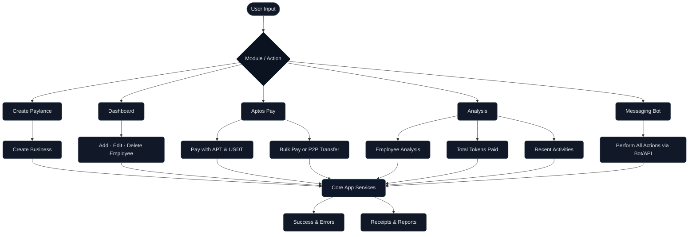

<div align="center">

  

  <h1>Aptos Paylance</h1>

  <p><strong>Decentralized payroll on Aptos</strong> — bulk and P2P payments in native APT and USDT using Move smart contracts.</p>

  <p>
    <a href="https://nextjs.org/">Next.js</a> •
    <a href="https://aptos.dev/">Aptos</a> •
    <a href="https://tailwindcss.com/">Tailwind</a>
  </p>

</div>

---

## ✨ Highlights

- **Wallet onboarding** for Aptos wallets (e.g., Petra, Martian)
- **Create and manage Paylance** (company payroll contract) per admin account
- **Add, edit, pause employees** with roles, email and salary
- **Bulk payroll**: pay multiple recipients in a single transaction
- **P2P transfer**: quick one-off payment to a single employee
- **Multi-token support**: APT (native) or USDC (fungible token)
- **Recent activity**: on-chain payments with search, filter and pagination
- **Production-ready**: responsive UI, Next.js App Router, Vercel deploy

## 🧱 Tech Stack

- Frontend: Next.js 15, React 19, TailwindCSS (see `my-app/`)
- Wallet & Contracts: Aptos Move, Aptos TypeScript SDK
- Chain: Aptos (Testnet)
- Tokens: APT (native), USDT (fungible token on Aptos)

## 🏗️ Architecture



> Infra notes: Under the hood we use Aptos Move for contracts, Aptos TypeScript SDK for transactions and wallet interactions, and optional USDT as a fungible token payout on Aptos.

### Flow

1. User connects an Aptos wallet (e.g., Petra/Martian).
2. App discovers/creates the company `Paylance` resource using Move modules.
3. Admin manages employees (add/edit/pause, set salaries).
4. Payments are executed from `Paylance`:
   - Bulk payroll (multiple accounts)
   - P2P transfer (single account)
5. Activity reads on-chain events for the Recent Activity dashboard.

## 📁 Project Structure (monorepo)

```
AptosDapp/
  my-app/           # Next.js frontend (UI, dashboards, actions)
  Dappcontract/     # Move contracts (Aptos), scripts and Chainlink examples
```

### Frontend (my-app)

```
my-app/
  src/app/          # Next.js App Router pages & components
  public/           # assets
  README.md         # additional implementation notes
```

### Contracts (Dappcontract)

```
Dappcontract/
  Move.toml
  sources/                  # core Move modules (e.g., paylance.move)
  scripts/                  # setup/deploy/pay flows
  ChainlinkDataFeeds/       # Chainlink data feed example modules
  ChainlinkPlatform/        # Chainlink platform helper modules
```

## 🔑 Environment Variables

Frontend may require environment variables depending on wallet/adapters you use.
Create `.env.local` in `AptosDapp/my-app/` as needed (example only):

```
# Example only — adjust to your libs
NEXT_PUBLIC_APP_NAME=Aptos Paylance
NEXT_PUBLIC_APP_NETWORK=testnet
```

Refer to your chosen Aptos wallet SDK for exact configuration.

## ▶️ Running locally

```bash
# Frontend
cd AptosDapp/my-app
npm i
npm run dev

# Contracts (Aptos CLI required)
cd ../Dappcontract
# initialize if needed: aptos init --profile default --network testnet
aptos move compile
# optional
aptos move test
# publish (make sure account is funded on testnet)
aptos move publish --profile default
```

## 🚀 Deploy

Frontend can be deployed to Vercel:
1. Set required `NEXT_PUBLIC_*` variables in Vercel → Project → Settings → Environment Variables
2. Push to your Git repo (or run `vercel --prod` from `my-app/`)
3. Vercel auto-detects Next.js and builds the app

Contracts are deployed with the Aptos CLI using `aptos move publish` from `Dappcontract/`.

## 🔒 Smart Contracts (Move)

Contracts live in `AptosDapp/Dappcontract/`:

- `sources/paylance.move` — stores employees, salaries and executes payments in APT/USDT
- `scripts/*.move` — helpers for setup, deploy and payroll execution
- `ChainlinkDataFeeds/` and `ChainlinkPlatform/` — example integrations for data feeds and helper storage

The app interacts with these modules using the Aptos TypeScript SDK from the frontend.

## 📸 Screens (high level)

- Dashboard: KPIs, employee table, responsive actions
- Aptos Pay: token select (APT/USDT), recipients list, amount overrides, bulk/P2P
- Analysis: recent activity with search/filter/pagination

## 🤝 Contributing

PRs and issues are welcome. Please follow conventional commits and keep changes scoped.

## 📄 License

This project is open-source. If you need a specific license, add it at the repo root.


